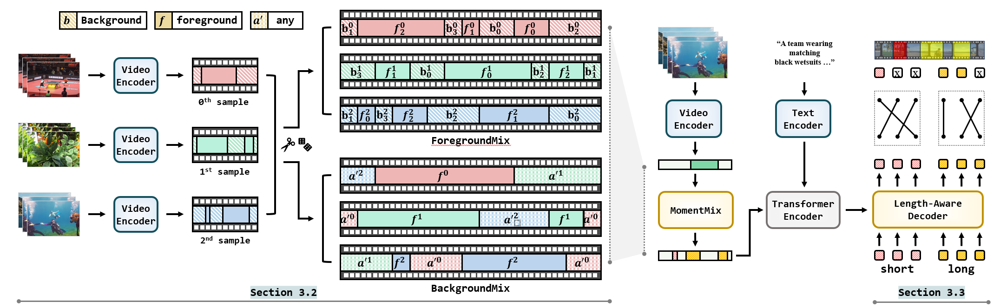

# Length-Aware DETR for Robust Moment Retrieval [[Paper](https://www.arxiv.org/abs/2412.20816)]

by Seojeong Park1, Jiho Choi1, Kyungjune Baek2, Hyunjung Shim1

1 Korea Advanced Institute of Science and Technology (KAIST), 2 Twelve Labs

 

## LICENSE
The codes are under [MIT](https://opensource.org/license/MIT) license.