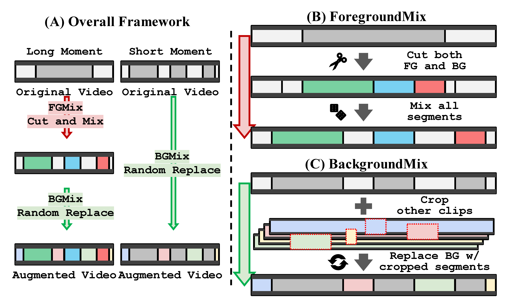

# MomentMix Augmentation with Length-Aware DETR for Temporally Robust Moment Retrieval  [[Paper](https://www.arxiv.org/abs/2412.20816)]

by Seojeong Park<sup>1</sup>, Jiho Choi<sup>1</sup>, Kyungjune Baek<sup>2</sup>, Hyunjung Shim<sup>1</sup>

<sup>1</sup> Korea Advanced Institute of Science and Technology (KAIST), <sup>2</sup> Sejong University


<a href='https://arxiv.org/pdf/2412.20816.pdf'></a> 


## 🔍 Overview

This repository provides the official implementation of **MomentMix** + **Length-Aware Decoder (LAD)** for improving short moment retrieval in Video Moment Retrieval tasks.

* **MomentMix** – A two-stage temporal data augmentation:

  * **ForegroundMix** – Splits long moments into shorter segments and shuffles them to enhance recognition of query-relevant frames.
  * **BackgroundMix** – Preserves the foreground while replacing background regions with segments from other videos, improving discrimination between relevant and irrelevant frames.

* **Length-Aware Decoder (LAD)** – Uses *length-wise bipartite matching* to pair predictions and ground truths within the same length category (**short / middle / long**), enabling length-specific decoder queries.


<p align="center">
  
  &nbsp;&nbsp;&nbsp;&nbsp;&nbsp;&nbsp;
  
</p>


---

## 📂 Contents
1. [Installation & Data Setup](#-installation--data-setup)
2. [MomentMix: Data Augmentation](#-momentmix--data-augmentation)
3. [Training with Length-Aware Decoder](#-training)
4. [Inference](#-inference)
5. [Pre-trained Checkpoints](#-checkpoint)

---

## 📦 Installation & Data Setup
Before training or evaluation, please make sure both the datasets and the runtime environment are ready.

### 1. Get the datasets ready

QVHighlights and the other benchmark datasets can be obtained by following the guidelines from [QD-DETR](https://github.com/wjun0830/QD-DETR).

### 2. Set up the code environment

   ```bash
   git clone https://github.com/sjpark5800/LA-DETR
   cd LA-DETR

   conda create -n ladetr python=3.10
   conda activate ladetr

   pip install -r requirements.txt
   ```

## 🎯 MomentMix : Data Augmentation

The dataset required for **MomentMix** is available in the `data/` directory.  
You can either:

1. **Use the pre-generated dataset** (recommended for reproducing our results), or  
2. **Generate your own** by following the detailed instructions in [`momentmix/README.md`](momentmix/README.md).  

*For experimental consistency, we strongly recommend using the provided pre-generated dataset.*

---


## 🚀 Training

The following scripts train our models with the proposed MomentMix and Length-Aware Decoder.

### QVHighlight


```
# For LA-QD-DETR,
bash la_qd_detr/scripts/train.sh

# For LA-TR-DETR,
bash la_tr_detr/scripts/train.sh

# For LA-UVCOM,
bash la_uvcom/scripts/qv/train.sh
```


### TACoS
```
bash la_uvcom/scripts/tacos/train.sh
```


### Charades-STA
```
# SlowFast + CLIP
bash la_uvcom/scripts/cha/train.sh

# VGG + Glove
bash la_uvcom/scripts/cha_vgg/train.sh
```


## 🧪 Inference

```
# For LA-QD-DETR,
bash la_qd_detr/scripts/inference.sh {exp_dir}/model_best.ckpt 'val'
bash la_qd_detr/scripts/inference.sh {exp_dir}/model_best.ckpt 'test'

# For LA-TR-DETR,
bash la_tr_detr/scripts/inference.sh {exp_dir}/model_best.ckpt 'val'
bash la_tr_detr/scripts/inference.sh {exp_dir}/model_best.ckpt 'test'

# For LA-UVCOM,
bash la_uvcom/scripts/inference.sh {exp_dir}/model_best.ckpt 'val'
bash la_uvcom/scripts/inference.sh {exp_dir}/model_best.ckpt 'test'
```
{exp_dir} refers to the directory containing the trained model checkpoint and logs.

> **Note:** For test results, please refer to [Moment-DETR evaluation](standalone_eval/README.md).


---

## 📦 Checkpoint

We release **pre-trained checkpoints** and **training logs** for all reported experiments to ensure reproducibility.
All model configurations are fully documented in the corresponding `opt.json` file.

📁 **[Download all checkpoints & logs here](https://drive.google.com/drive/folders/1-GPsLkpaBcxBx49TYL7QDOLA_zxuXj-2?usp=drive_link)**

| Dataset        | Method         | Model file                          |
| -------------- | -------------- | ----------------------------------- |
| QVHighlights   | QD-DETR + Ours | [🔗 checkpoint & log](https://drive.google.com/drive/folders/1z887E7g3jhglfClCGWWNLGELlp3jcLof?usp=drive_link) |
| QVHighlights   | TR-DETR + Ours | [🔗 checkpoint & log](https://drive.google.com/drive/folders/12FsRopACZ7QTa9LEtCBNwDwX7cZ20WGg?usp=drive_link) |
| QVHighlights   | UVCOM + Ours   | [🔗 checkpoint & log](https://drive.google.com/drive/folders/1aW-XuqmdoyTcLJQOWp4lV614LXEI3_jT?usp=drive_link) |
| TACoS          | UVCOM + Ours   | [🔗 checkpoint & log](https://drive.google.com/drive/folders/1f6W_A-XfZaTkVElRGcNYoE4fZ2YIpZ6D?usp=drive_link) |
| Charades       | UVCOM + Ours   | [🔗 checkpoint & log](https://drive.google.com/drive/folders/17jLoQ4xsQMBOsG_eCsBSwCw9SY4QJlq7?usp=drive_link) |
| Charades (VGG) | UVCOM + Ours   | [🔗 checkpoint & log](https://drive.google.com/drive/folders/1a96C9OMJ1gy2As2NkgfCmNWiYDIVm163?usp=drive_link) |


---
## 📚 Citation
If you find this work useful, please cite:
```
@article{park2024length,
  title={Length-Aware DETR for Robust Moment Retrieval},
  author={Park, Seojeong and Choi, Jiho and Baek, Kyungjune and Shim, Hyunjung},
  journal={arXiv preprint arXiv:2412.20816},
  year={2024}
}
```


## 📜 License
All code in this repository is released under the MIT License.

## 🙏 Acknowledgements
Parts of the annotation files and several implementation components are adapted from [Moment-DETR](https://github.com/jayleicn/moment_detr), [QD-DETR](https://github.com/wjun0830/QD-DETR), [TR-DETR](https://github.com/mingyao1120/TR-DETR), and [UVCOM](https://github.com/EasonXiao-888/UVCOM).